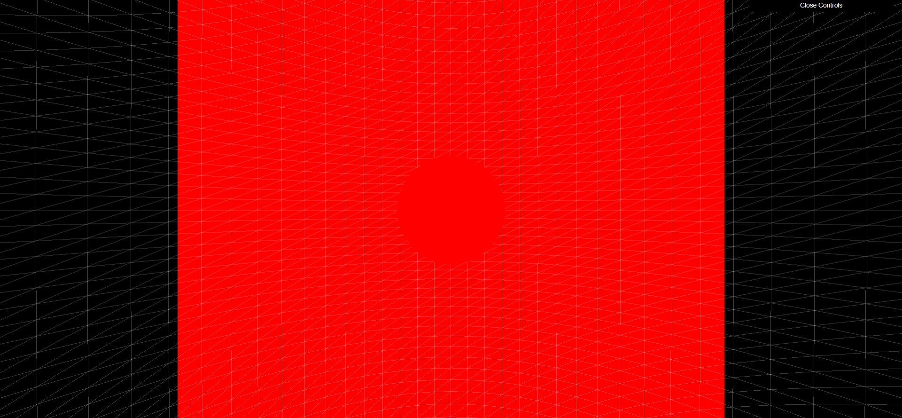

# threedmouseelements
3D Mouse movement tracker good looking UI.

### Some Screenshots


## Three.js Starter
Courtesy of Bruno Simon of https://threejs-journey.xyz/

### Setup
Download [Node.js](https://nodejs.org/en/download/).
Run this followed commands:

``` bash
# Install dependencies (only the first time)
npm install

# Run the local server at localhost:8080
npm run dev

# Build for production in the dist/ directory
npm run build
```